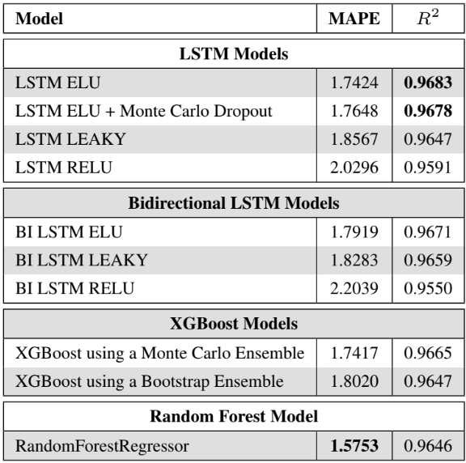

# **Prediction of Energy Demand by Neighborhood in Barcelona for Sustainable Resource Management**

## Overview
This repository contains the code and analysis for predicting **electricity demand** in **Barcelona**, disaggregated by **postal code**, using **machine learning algorithms**. The project was developed as part of a **thesis** and includes uncertainty quantification techniques to ensure reliable predictions. The models are trained on **multidimensional datasets** that include electricity consumption, meteorological data, and economic indicators.

The goal of the project is to provide insights into the factors influencing energy consumption and help optimize resource management for a more **sustainable** and **efficient** energy system in urban environments.

## Key Features
- **Prediction Models**: The code includes implementations of multiple machine learning algorithms, including:
  - **Random Forest Regressor**
  - **Extreme Gradient Boosting (XGBoost)**
  - **Neural Networks (LSTM and Bidirectional LSTM)**

- **Uncertainty Quantification**: The uncertainty associated with predictions is calculated for all models using techniques such as:
  - **Monte Carlo Dropout**
  - **Ensemble Methods**

- **Multidimensional Dataset**: Data includes electricity consumption, weather information, and economic indicators, covering the years **2019-2024** for Barcelona.
  - **Electricity Consumption Data**: Sourced from the **Barcelona Energy Observatory** and the **Barcelona Open Data portal**.
  - **Meteorological Data**: Sourced from the **Open Meteo API**.
  - **Economic Indicators**: Sourced from the **National Statistics Institute (INE)**.

- **Data Processing and Feature Engineering**: The repository includes scripts for cleaning, preprocessing, and feature engineering to prepare the dataset for model training.

# Results

Here are the final results from the models' performance:

# Contact

**Aleix Francia Albert**  
**Email**: afranciaa2501@gmail.com  
**Thesis supervised by**: Albert Romero Sánchez (Department of Computer Science)

